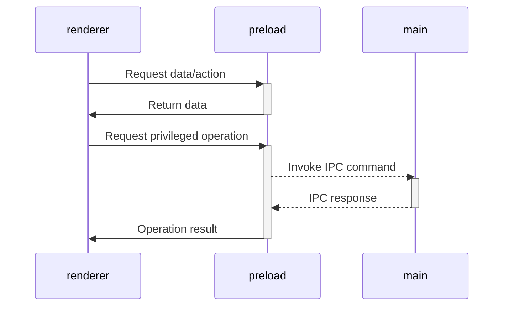

# Smyles Station

A secure, kid-friendly computer kiosk designed for libraries, schools, and community centers. Smyles Station provides safe access to educational games and websites with time management, content control, and automatic shutdowns.


## For Librarians & Administrators

**Looking to install or use Smyles Station?** Please visit the [documentation website](#buff-sudo.github.io/Smyles-Station/) for complete setup and usage guides including:

- Installation instructions
- Setting up kiosk mode
- Managing time limits
- Adding games and websites
- Configuring automatic shutdowns
- Daily operations and troubleshooting

## For Developers

This is an Electron-based application built with security and simplicity in mind.

### Quick Start

```sh
# Install dependencies
npm install

# Start in development mode
npm start

# Build for production
npm run build

# Compile executable
npm run compile

# Run tests
npm test
```

### Project Structure

This project is organized as a monorepo with the following packages:

- **`packages/main`** - Electron main process (Node.js runtime)
- **`packages/preload`** - Preload scripts (secure bridge between main and renderer)
- **`packages/renderer`** - React-based UI
- **`packages/integrate-renderer`** - Build tooling for renderer integration
- **`packages/electron-versions`** - Helper utilities for Electron version management

### Key Features

- Password-protected admin panel
- Sandboxed browser views for games
- URL whitelist enforcement
- Time-limited sessions with warnings
- Scheduled automatic shutdowns
- Usage statistics tracking

### Technology Stack

- Electron 38+
- React
- Vite
- TypeScript
- Playwright (testing)

### Development Guidelines

- Security-first architecture following [Electron security best practices](https://www.electronjs.org/docs/tutorial/security)
- Context isolation enabled
- Sandboxed renderers
- No Node.js APIs in renderer process (use preload bridge)
- All environment variables prefixed with `VITE_` are exposed to renderer

### Architecture

The application follows Electron's security model:



### Contributing

Contributions are welcome! Please see the [documentation](docs/dev/contributing.md) for:

- Development setup
- Architecture overview
- Code style guidelines
- Testing requirements

### Building

The application uses electron-builder for packaging:

```sh
# Build and package (with auto-update support disabled)
npm run compile

# Build for debugging (unpackaged, no asar)
npm run compile -- --dir -c.asar=false
```

### Testing

End-to-end tests use Playwright:

```sh
npm test
```

### Requirements

- Node.js >= 23.0.0
- npm workspaces support

## License

See LICENSE file for details.

## Attributions

This project includes code and resources from various sources:
- Electron Vite Builder template
- AI-generated code from Claude AI (Anthropic)
- Third-party libraries (React, Electron, Vite, TypeScript, etc.)
- Service icons (PBS Kids, ABC Mouse)

See [ATTRIBUTIONS.md](ATTRIBUTIONS.md) for complete details and license information.

## Contact

For security issues or questions, contact: smyles-station-safety@proton.me
